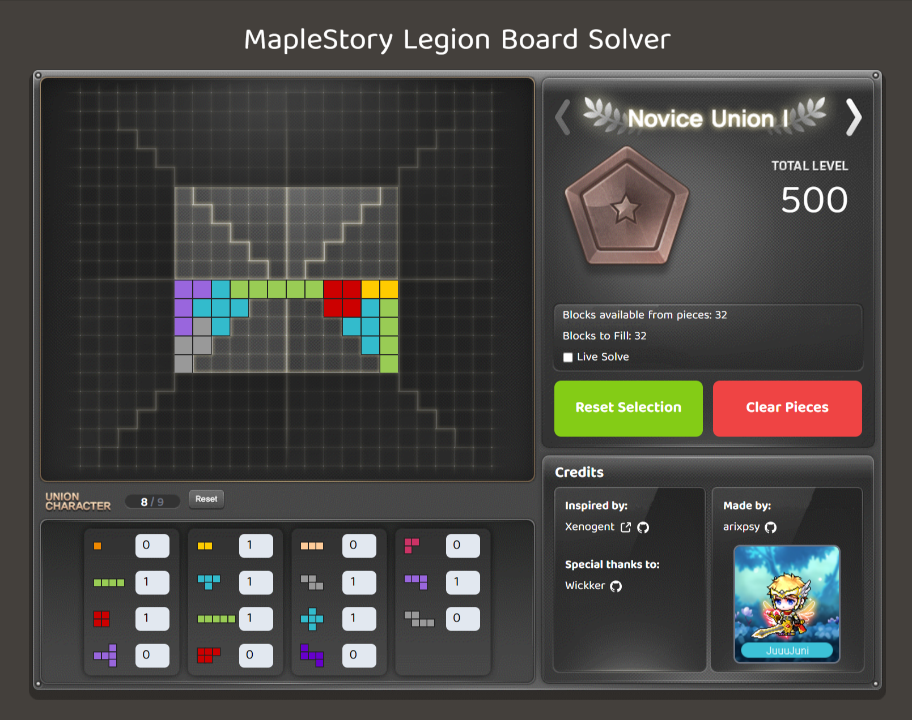

# MapleStory Legion Board Solver



A web-based solver for the MapleStory Legion Board, designed to help players optimize their piece placements for maximum efficiency.

## Tech Stack
- **SvelteKit** — Application framework
- **Svelte 5** — UI components
- **TypeScript** — Type safety
- **Vite** — Build tool
- **Tailwind CSS** — Utility-first CSS framework
- **PostCSS** — CSS processing
- **Vitest** — Unit testing
- **ESLint & Prettier** — Linting and code formatting
- **Luxon** — Date/time utilities
- **nanoid** — Unique ID generation
- **clsx** — Conditional classNames
- **2d-array-rotation** — Array manipulation
- **tailwind-merge** — Tailwind class merging

## Features
- Interactive Legion board UI
- Live solve and optimization
- Reset and clear options

## Getting Started

### Prerequisites
- [Node.js](https://nodejs.org/) (v16 or higher recommended)

### Installation
```bash
pnpm install
```

### Running the App
```bash
pnpm dev
```
Then open [http://localhost:5173](http://localhost:5173) in your browser.

## Project Structure
- `src/` — Main source code
  - `lib/` — Components, classes, assets, types, and utilities
  - `routes/` — SvelteKit routes
- `static/` — Static assets (favicon, images)

## Credits
- **Inspired by:** [Xenogen](https://github.com/Xenogents/LegionSolver)
- **Special thanks:** [Wickker](https://github.com/Wickker)

## License
This project is licensed under the MIT License. See the [LICENSE](LICENSE) file for details.
